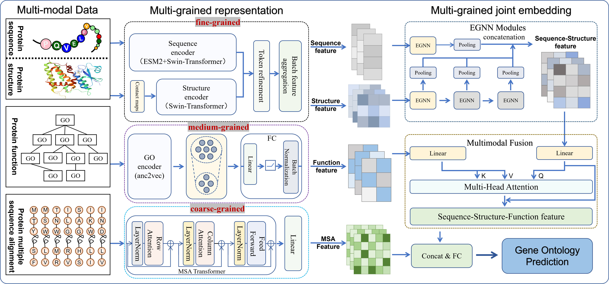

# **A multimodal learning framework for protein function prediction based on multi-grained joint embedding**

Protein function prediction is an important task in bioinformatics.Accurately annotating protein functions is crucial for understanding biological processes and for corresponding biological analyses. Therefore, we proposes a protein function annotation method that efficiently integrates multiple sources of information to fully represent proteins, aiming to advance protein function annotation.

The operation process is as follows
- Calculate the ESM features.
- Obtain the structure data of AlphaFold.
- The calculation of MSA is based on the MSA transformer.

The specific training process can be found in /Run/train.py
